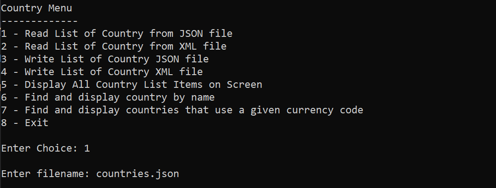

# Country Dataset Reader Writer

### About

A console application built with C#. Displays a menu to the user. The user can open a JSON file. The data from the JSON file gets stored in memory. The user can then view the data, save it to another JSON file, or save it to a XML file.

### Image

